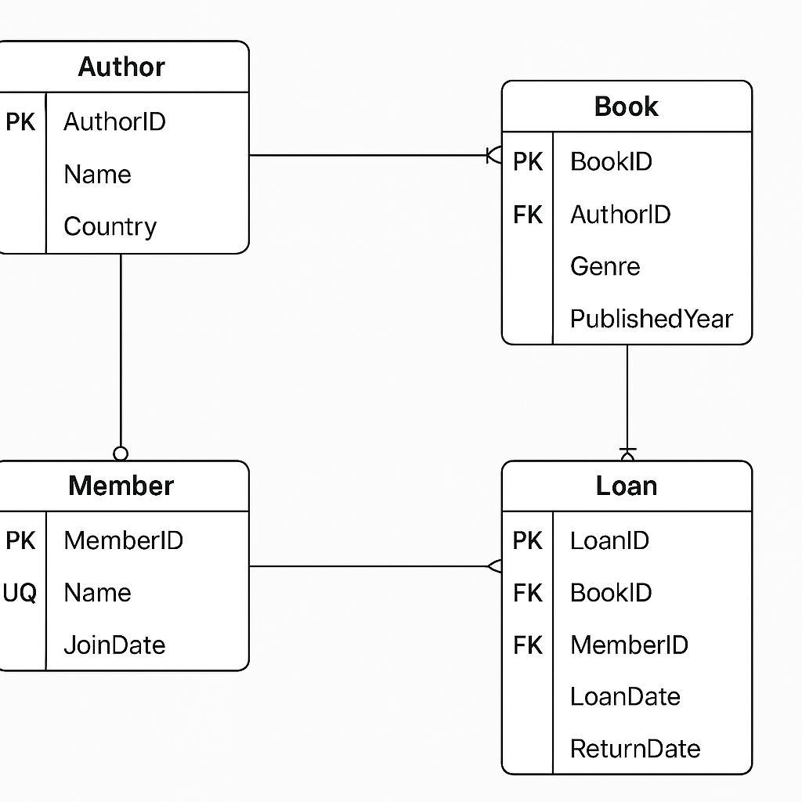

# Library Management Database - MySQL

## 📌 Overview
This project is part of the SQL Developer Internship Task 1.
It demonstrates how to design a database schema, create tables, and define relationships using MySQL.

## 🗂 Database Schema
**Entities:**
- Author
- Book
- Member
- Loan

**Relationships:**
- Author → Book (1:M)
- Book → Loan (1:M)
- Member → Loan (1:M)

## 🛠 How to Run
1. Open **MySQL Workbench**.
2. Create a new SQL script.
3. Copy and paste the content from `schema.sql`.
4. Run the script (⚡ icon).
5. Refresh the schema list to view the `LibraryDB` database.

## 📊 ER Diagram

## ✍️ Author
Created by Jagadeesan for SQL Developer Internship Task 1.
